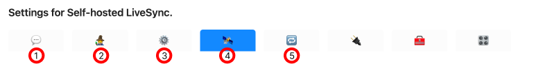
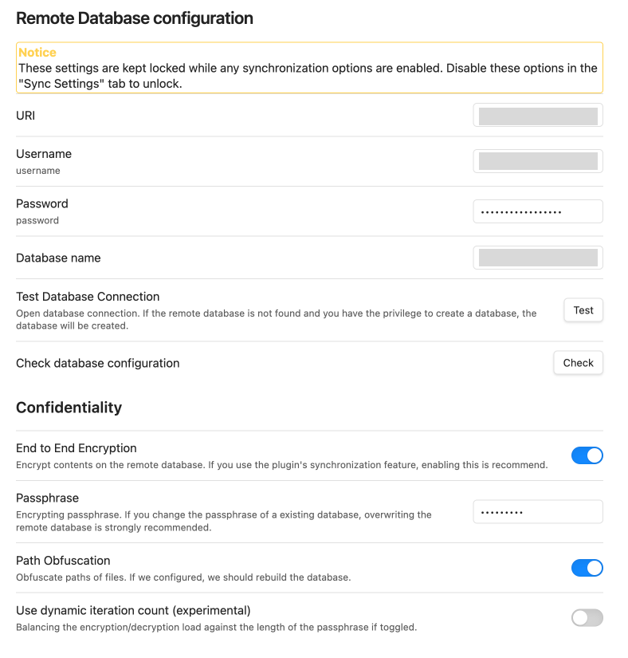
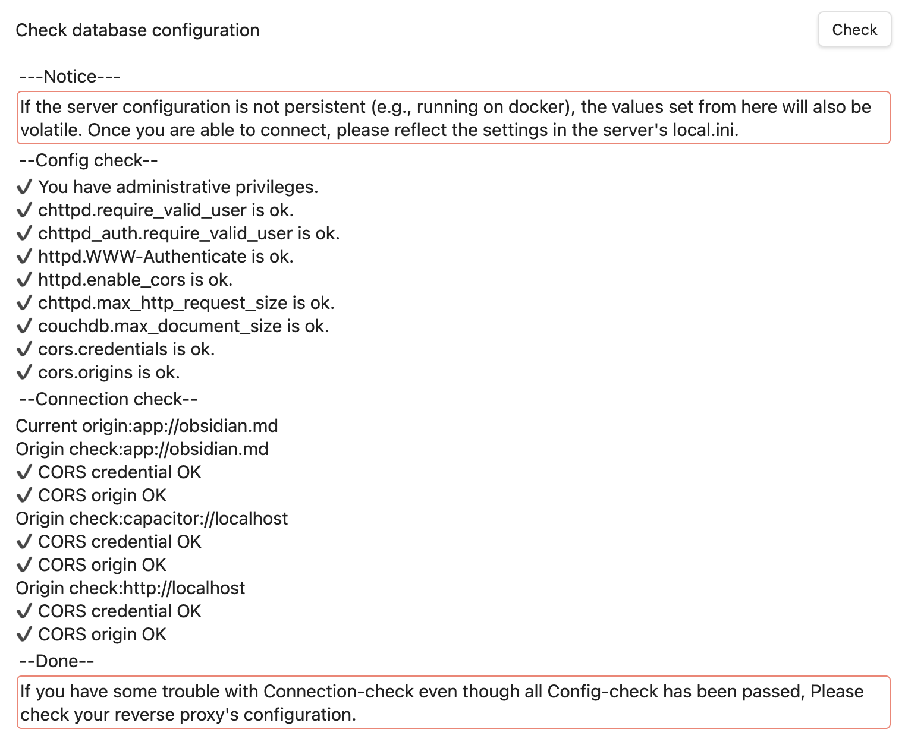
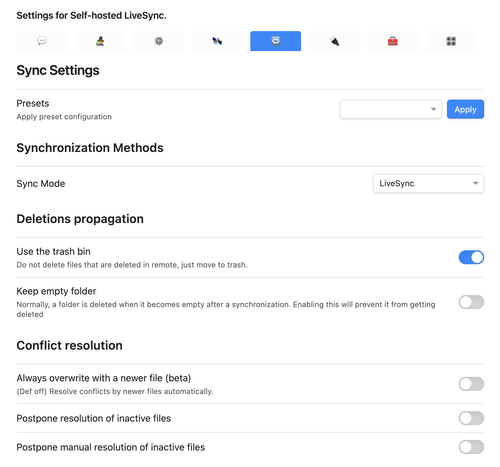
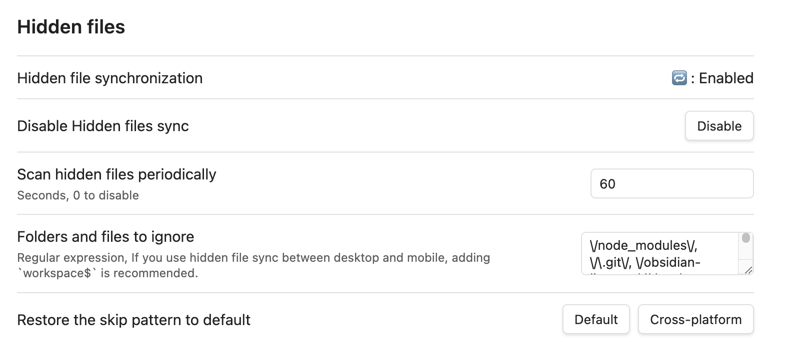
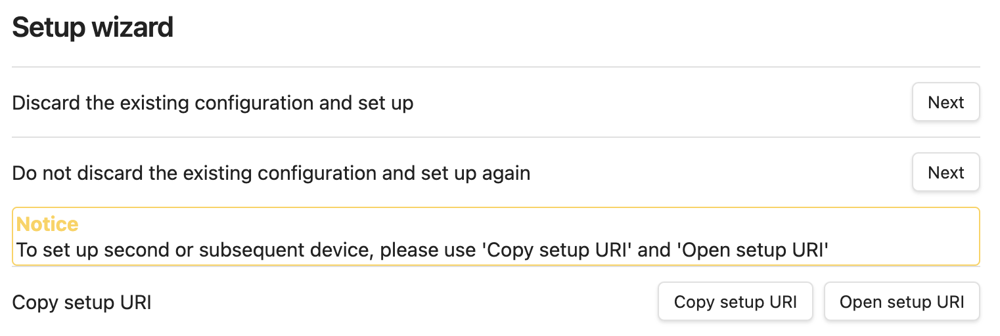
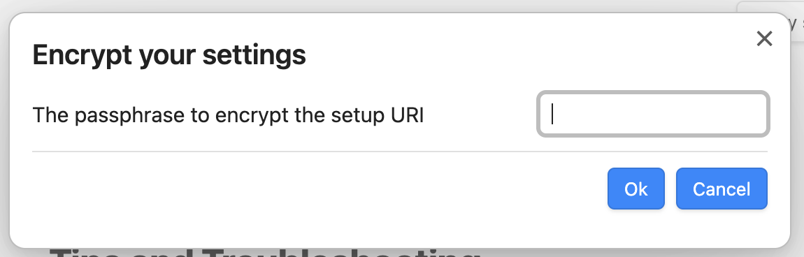

notion에서 obsidian으로 노트앱을 갈아탄 후에 markdown 파일들을 내가 관리할 수 있는 것은 좋았지만

맥북, 아이폰, 아이패드 등에서 공유하는 것이 생각보다 불편하였다. icloud를 사용해서 연동하는 것이 가능하긴 했지만

icloud 특유의 느린 sync 속도가 노트의 크기가 커질 수록 답답하게만 느껴졌다.

그러던 차에 [obsidian-livesync](https://github.com/vrtmrz/obsidian-livesync)라는 커뮤니티 플러그인을 발견했다.

# obsidian-livesync 란?

이 플러그인은 CouchDB를 이용해서 여러 기기간 동기화를 지원한다.

CouchDB 호스트(서버와 오프라인 클라이언트)들은 동일한 데이터베이스의 독립적인 복제본을 가질 수 있다고 한다.

Document 마다 Revision을 관리해서 변경된 Document만 업데이트 할 수 있도록 충돌 감지 및 관리 기능이 내장되어 있다.

> [출처](https://cwiki.apache.org/confluence/display/COUCHDB/Introduction#Introduction-KeyCharacteristics)

CouchDB의 이러한 특성을 이용해서 여러 기기간 동기화를 할 수 있도록 만든 플러그인이다.

# 설정법

CouchDB 설치방법은 [이전 글](https://blog.preinpost.in/detail/docker%20%EA%B8%B0%EB%B0%98%20couchdb%20%ED%81%B4%EB%9F%AC%EC%8A%A4%ED%84%B0%20%EC%84%B8%ED%8C%85%20%EC%8B%9C%20%EB%84%A4%ED%8A%B8%EC%9B%8C%ED%81%AC%20%EC%84%A4%EC%A0%95%EB%B2%95)을 참고하면 될 것 같다.

이 글에서는 CouchDB가 이미 설치되어 있다고 가정하고, Obsidian 플러그인 쪽 설정부분만 다루려고 한다.

[플러그인 가이드 문서](https://github.com/vrtmrz/obsidian-livesync/blob/main/docs/quick_setup.md)서도 자세히 볼 수 있다.

## 최초 설정법

> obsidian-livesync 설정메뉴

2번 탭을 눌러서 Setup wizard를 통해서 할 수도 있고 4번탭을 눌러서 직접 Remote Database 설정을 할 수도 있다.

개인정보들이 노트에 저장될 수 있으므로 왠만하면 도메인을 하나 따서 https로 적용하는게 좋을 것이다.

필자는 caddy를 reverse proxy로 앞단에 두고 CouchDB와 연동하였다.

Test 버튼과 Check 버튼을 눌러서 정상적으로 되는지 확인하자

체크 버튼의 경우 처음에 x 로 표시된 것들이 있을텐데 v로 바꿀 수 있게 alert으로 안내해준다.

Sync Mode를 수정해서 언제 동기화 되게 할 건지 입맛에 맛게 수정할 수 있다.

hidden files 부분을 enabled 해주면 테마 설정이나 플러그인 설정을 모든 기기와 동기화 시킬 수 있다.

## 최초 설정 후 다른기기 설정법

최초 설정이 완료되었으면, 다른 기기 연동은 수월하다.

2번 탭으로 이동해서

`Copy setup URI`를 누르면

위와 같은 창이 뜬다.

간단하게 비밀번호를 입력하고 OK 버튼을 누르면 URI가 클립보드에 Copy 되었다고 나오는데,

그 URI를 연동할 기기에 Obsidian-livesync 플러그인을 설치하고 `Open setup URI` 버튼을 눌러서

뜨는 창에 복사해서 넣어준 다음 Copy 시, 입력했던 비밀번호를 넣어주면 동기화가 시작된다.