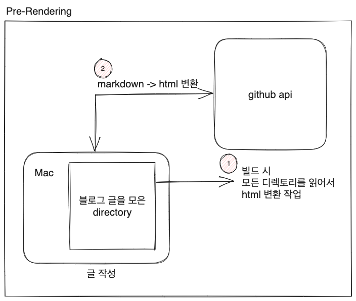

# 배경

이전에 여러번 블로그를 직접 만들려는 시도가 있었지만 서버와 프론트를 따로 나눠서 처리하다 보니 관리가 잘 안되는 문제가 있었다.

마음 한켠에 마음이 들지 않는 구석이 있어서 그런지 글도 잘 안써지고.. 그렇게 블로그를 해야지 해야지 마음속으로만 생각하다가 드디어 첫 삽을 뜨고 작업을 시작했다.

obsidian 이라는 markdown 프로그램을 기록용으로 사용하고 있는데, 여기서 글을 작성하고 블로그로 올리는 구조로 만들면 좋을 것 같았다.

# 설계

### 요구사항으로 잡은 것은 다음과 같았다.
1. gfm (github favored markdown)으로 글을 랜더링 할 것 + gfm 용 css 추가
2. 서버 없이 글의 내용과 메타데이터(title, createDate, tag, image)을 관리하고, 뿌려줄 수 있어야함
3. 글의 리스트를 보여줄 수 있어야하고 상세 페이지도 포함되어야 한다
4. 리스트 페이징을 처리 할 수 있어야한다.
5. 글과 태그를 검색할 수 있어야 한다.

서버 없이 블로그를 만들어야 했기 때문에 next.js 의 ssg(static site generator)를 사용하여 사전에 모든 글을 html로 만들어서 github에 push하는 구조로 만들어야 했다.

text data 를 gfm으로 바꿔주는 github api가 있어서 따로 라이브러리를 사용하지 않고 pre-rendering 시 해당 api를 호출해서 html로 변환하는 처리를 해줬다.

코어 기능은 정의가 되었으므로 이제 화면을 이쁘게 해주는 작업을 해줘야 한다.
이 전에 mui를 사용해 본 적 있었으나 이번에는 next.js  와 찰떡궁합이라는 tailwind css 를 사용해서 화면작업을 했다.

