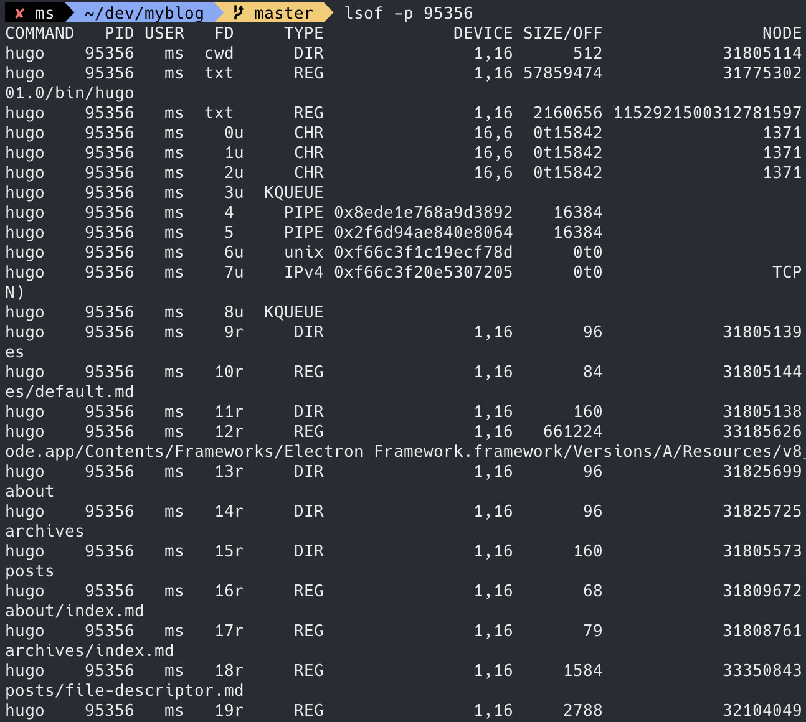
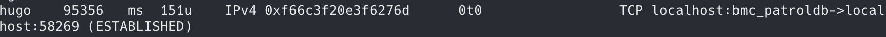

회사에서 C 기반의 TCP Client를 구현해야 할 일이 생겨서 소켓의 동작방식을 자세히 알아보게 되었다.

그런데 socket에 대해 알아보기 전에 먼저 file descriptor에 대해 알아볼 필요가 있다.

# File Descriptor란?
파일 서술자라고 부르며 프로세스가 생성될 때 프로세스 만의 File Descriptor Table이 생성되고, 테이블에는 3개의 기본 표준 입출력 file descriptor (이하 fd)이 생성된다.

| 정수값 |        이름        |
| :----: | :----------------: |
|   0    | 표준 입력 (stdin)  |
|   1    | 표준 출력 (stdout) |
|   2    | 표준 오류 (stderr) |

이 3개의 입출력은 흔히 터미널에서 `ps -ef | grep [something]` 처럼 사용하는 파이프를 이용한 명령어나 프로세스 실행 시, `nohup a.py 1>out.log 2>error.log` 와 같은 명령어에서 무의식적으로 사용하는 것과 동일하다.

사용자 정의 fd는, 파일을 open 하거나, socket을 생성하는 등의 방법으로 생성할 수 있다.

| 정수값 |        이름        |
| :----: | :----------------: |
|   0    | 표준 입력 (stdin)  |
|   1    | 표준 출력 (stdout) |
|   2    | 표준 오류 (stderr) |
|   3    |     file open      |
|   4    |       socket       |
> 위의 표 처럼 일종의 fd pointer가 생성된다.

> 프로세스의 fd도 lsof (list of open file) 명령어로 확인 가능하다
> 
> 숫자뒤에 붙는 r은 읽기전용, w는 쓰기전용, u는 rw (양방향) 의미이다

# Socket 이란?

소켓은 fd의 하나로 양방향 스트림 연결이 가능하다.

소켓의 흐름은 다음 그림과 같다.

> 소켓 LifeCycle
> 
> 출처 : https://en.wikipedia.org/wiki/Berkeley_sockets

### Server의 경우
1. socket 생성
   + TCP로 사용할지, UDP로 사용할지 정한다.
   + 소켓은 ip4를 사용할지,ip6을 사용할지 정한다.
   + 위의 항목을 정하고 서버의 경우에는 소켓을 생성하여 fd를 받는다.
2. socket Bind
   + TCP로 사용할지, UDP로 사용할지 정한다.
   + 어떤 포트를 소켓과 연결할지 정한다.
   + 어떤 ip만 수신할지 정한다.
3. socket Listen
   + bind를 했으면 이제 소켓은 외부의 입력에 반응한다
4. socket Accept
   + 외부에 입력이 들어오면 새로운 fd를 생성한다. (매 accept 마다 새로운 fd가 생성됨)
   + accept fd 를 이용해서 client와 양방향 통신을 한다.

### Client의 경우
1. socket 생성
   + 클라이언트도 소켓을 생성하여 fd를 받는다.
2. socket Connect
   + TCP로 사용할지, UDP로 사용할지 정한다.
   + 어떤 포트를 소켓과 연결할지 정한다.
   + 어떤 ip에 연결할지 정한다.
   + 위의 항목을 정하고 연결한다.
   + 연결이 성공했으면, fd를 이용하여 server와 양방향 통신을 한다.

> lsof로 소켓 생성을 확인 할 수 있다.

# 마치며

운영체제에서 입출력을 다루는 방법에 대한 개념을 명확하게 알면, 다른 언어를 사용할 때에도 같은 개념으로 접근한다면 쉽게 이해할 수 있을 것 같았다.

Java의 경우에는 InputStream이나 OutputStream이 기본적인 입출력 방법이고, 여러가지 Decorator Pattern이 적용된 Stream들을 필요한 부분에 맞춰서 사용하면 된다.

소켓도 역시 stream이므로 서로 연결된 이후부터는 파일 stream과 동일하게 생각하니 이해하기 쉬웠다. 이런 부분들 때문에 운영체제 공부의 중요성을 다시 한번 더 느꼈다.