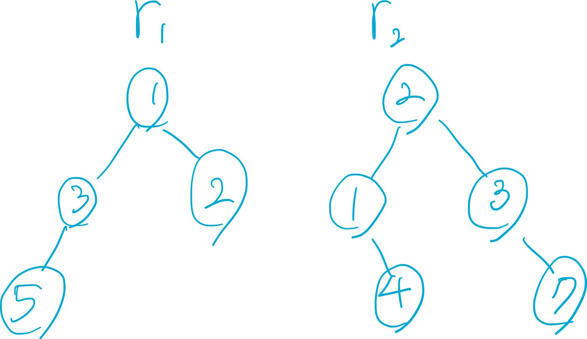
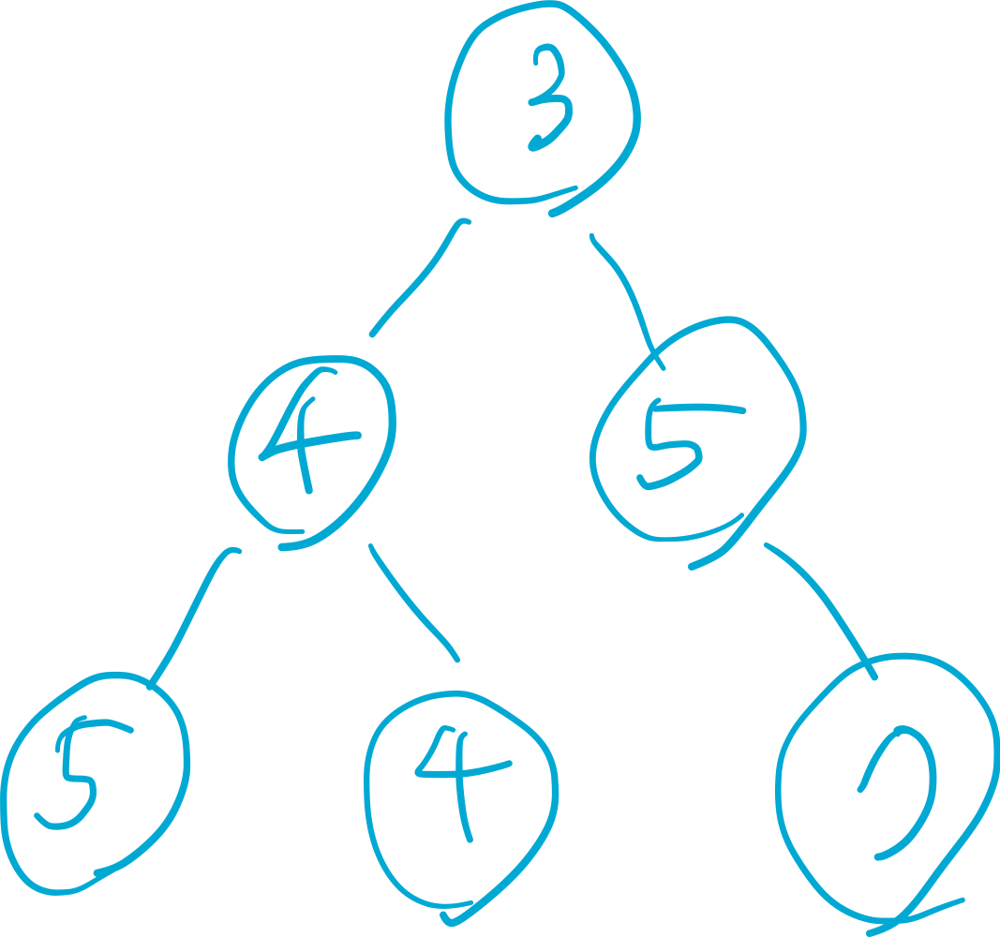

# 617. Merge Two Binary Trees (Easy)

## 문제
[문제](https://leetcode.com/problems/merge-two-binary-trees/)

## 문제해설
두개의 이진 트리가 주어진다.\
두개의 이진 트리를 겹쳤을 때, 겹친 노드들의 숫자들을 더한 트리를 구하면 된다.



한쪽 노드만 존재하는 경우에는 그 노드만 새로 추가하는 트리에 붙여주면 된다.\
더한 모습은 아래 이진 트리와 같다.



## 풀이

[조건]
1. 노드의 값을 더하는 경우는 roo1, root2 노드 둘 다 존재해야 할 수 있다.
2. 한쪽의 노드가 존재하지 않을 때에는 존재하는 쪽의 노드를 새로 만드는 노드에 붙여주면 된다.
3. 둘다 존재하지 않을 때에는 상위 스탣으로 돌아간다.

[진행]
1. 루트 노드부터 pre-order로 순회해간다.
2. 양쪽 노드가 존재할 때에만 `TreeNode`를 생성할 수 있다.
3. 생성된 노드에서 left, right가 붙어나간다. (둘다 있으면 더해지고, 한쪽만 존재하면 존재하는 쪽이 추가됨)

## 코드
```java
class Solution {
    public TreeNode mergeTrees(TreeNode root1, TreeNode root2) {
        if (root1 == null && root2 == null) return null;
        else if (root1 == null) return root2;
        else if (root2 == null) return root1;
        
        return new TreeNode(root1.val + root2.val, mergeTrees(root1.left, root2.left), mergeTrees(root1.right, root2.right));
    }
}
```